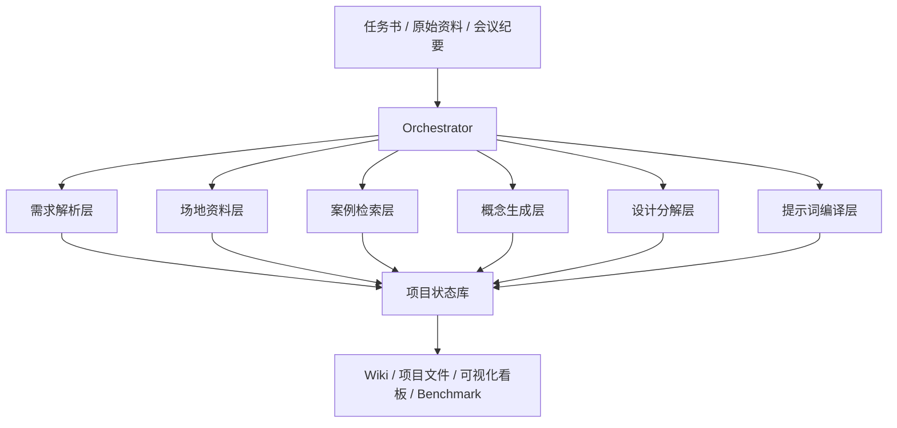

# 空间设计 AI 工作流 V1 系统设计文档

**版本**: V1  
**日期**: 2026-04-15  
**状态**: 可执行设计  
**适用范围**: 展厅 / 企业展馆 / 品牌体验空间 / 科技展示空间

---

## 1. 文档目的

本文档定义当前仓库的 V1 目标系统。它不是概念方案，也不是愿景描述，而是后续产品、工程、评估、数据标注、运营协作的统一执行基线。

V1 要解决的问题只有一个:

> 输入一份项目任务书和项目资料，系统能够产出一套可追溯、可复查、可继续迭代的设计前期成果包，足以替代人工前期研究、资料整理、案例对标、概念发散和出图提示词编制中的大部分重复劳动。

V1 不追求“自动完成全部设计”。V1 追求的是:

- 正确理解项目
- 正确沉淀资料
- 正确调用案例经验
- 正确生成多个可讨论的概念方向
- 正确把讨论结果回灌到后续设计流程
- 正确输出可直接进入图像生成与人工评审的提示词包

如果某一步不能解释“为什么这样输出”，该步视为未完成。

---

## 2. V1 的完成定义

只有同时满足以下条件，V1 才允许被宣称“完成”:

1. 输入一份真实任务书后，系统能产出结构化需求清单，并为每条需求提供证据和置信度。
2. 输入现场资料后，系统能把 CAD、照片、3DGS 衍生内容统一转成项目 wiki 与约束清单。
3. 输入需求与约束后，系统能从企业案例库召回相关案例，并说明相关原因，而不是只给相似文本。
4. 系统能稳定生成 3 套概念方向，每套概念都能映射到需求、场地约束和案例依据。
5. 会议纪要或语音转写结果可以回灌系统，并影响下一轮概念与设计分解。
6. 系统能输出一套图片提示词工程包，包含多方案、多视角、多变体策略，不是只有单句 prompt。
7. 所有关键产物都能落盘到固定目录，且可以被后续 agent 和人类复用。
8. 至少存在一组离线 benchmark，可以验证需求提取、案例召回、概念采纳与会议回写的质量。

---

## 3. 非目标

以下内容不属于 V1 的交付承诺:

- 施工图自动生成
- 自动 BIM 建模
- 精确造价清单
- 自动完成动画剪辑
- 替代主案设计师做最终审美判断
- 一步到位生成最终汇报文件

V1 的定位是“前期研究与概念生产线”，不是“全自动设计交付系统”。

---

## 4. 当前仓库基线

当前仓库已经具备以下基础组件，可直接复用:

- `design_workflow/agents/orchestrator.py`
  负责按阶段调用 specialist，目前已存在 `run_mvp_workflow` 与 `run_full_workflow`
- `design_workflow/specialists/*.py`
  已存在 `req_parser`、`case_research`、`concept`、`zoning`、`material_style`、`visual_prompt` 等 specialist 雏形
- `src/agent_runtime/board.py`
  已具备项目阶段看板、artifact 状态与阶段摘要落盘能力
- `src/agent_runtime/storage.py`
  已具备会话快照、checkpoint、blob 存储能力
- `src/agent_runtime/schemas.py`
  已具备基础事件模型，可承载 trace 和审计日志
- `wiki/` 与 `design_library/`
  已存在企业知识页和风格设计库入口
- `evaluation/fixtures/`
  已存在评估样本雏形，可扩展成 benchmark

V1 不是推翻现有代码，而是在现有结构上把“缺失的生产闭环”补齐。

---

## 5. V1 总体架构

V1 采用“有状态编排器 + 分层 specialist + 企业知识库 + 审计日志”的结构。



### 5.1 运行原则

- 所有阶段必须有固定输入 schema。
- 所有阶段必须有固定输出 schema。
- 所有推断必须记录证据来源。
- 所有 agent 输出必须可被下游阶段复用，不能只是自然语言段落。
- 所有重要状态必须落盘，不能只存在当前会话上下文。
- 所有阶段必须定义“失败时如何停止”和“缺信息时如何升级为待补充问题”。

### 5.2 核心运行对象

- `Project`
  一个真实项目实例
- `Artifact`
  某一阶段的结构化输出
- `Evidence`
  支撑结论的输入片段、文件或引用
- `Decision`
  人工会议或审批产生的设计决策
- `CaseCard`
  已清洗和标注的企业案例单元
- `PromptPackage`
  可直接投喂图像生成模型的成套提示词资产

---

## 6. 目录与产物落盘规范

V1 统一使用项目目录落盘，目录定义如下:

```text
output/projects/<project_id>/
  intake/
    brief.md
    meeting_raw/
    site_assets/
  artifacts/
    structured_brief.json
    requirements.md
    requirements_evidence.json
    site_manifest.json
    site_context.md
    site_constraints.json
    case_queries.json
    case_pack.json
    concept_round_1.json
    decision_log_round_1.json
    concept_round_2.json
    design_program.json
    prompt_package_round_1.json
    image_selection_round_1.json
  wiki/
    index.md
    pages/
      project-overview.md
      site-constraints.md
      case-pack.md
      concept-history.md
      design-program.md
  logs/
    events.jsonl
    tool_calls.jsonl
    audit.jsonl
  board/
    project_board_current.json
```

说明:

- `output/projects/<project_id>/artifacts` 是后续 agent 的直接输入源。
- `output/projects/<project_id>/wiki` 是给人类浏览与复盘的阅读层。
- `output/projects/<project_id>/logs` 是审计与问题追查层。
- 当前 `src/agent_runtime/board.py` 的产物可迁移到项目级 `board/` 目录。

---

## 7. 端到端阶段设计

V1 拆为 6 个核心阶段和 1 个可选尾段。只有前 6 段构成 V1 交付范围。

### 阶段 0: 项目建档

**目标**  
建立项目 ID、输入目录、运行看板、trace_id 和基础元数据。

**输入**

- 项目名称
- 客户名称
- 项目任务书原文
- 当前运行模式: `brief_only | concept_loop | full_v1`

**输出**

- `output/projects/<project_id>/intake/brief.md`
- `output/projects/<project_id>/board/project_board_current.json`
- `output/projects/<project_id>/logs/events.jsonl`

**实现位置**

- 修改 `design_workflow/agents/orchestrator.py`
- 复用 `src/agent_runtime/board.py`
- 复用 `src/agent_runtime/schemas.py`

**完成标准**

- 任一项目首次进入系统后，有唯一 project_id 和 trace_id
- 后续所有 artifact 都能挂到该 project_id 下

### 阶段 1: 任务书解析与真实需求推断

**业务问题**  
用户给的是任务书，不是完整需求。系统必须输出“真实需求清单”，不是只摘抄原文。

**输入**

- `intake/brief.md`
- 客户补充信息
- 品牌资料或过往沟通摘要

**输出**

- `structured_brief.json`
- `requirements.md`
- `requirements_evidence.json`
- `missing_questions.json`

**最低输出字段**

```json
{
  "project_type": "tech_showroom",
  "site_location": "Nanjing",
  "area_sqm": 1200,
  "target_audience": ["government", "enterprise_client"],
  "business_goals": [],
  "explicit_requirements": [],
  "inferred_requirements": [],
  "risk_flags": [],
  "missing_information": []
}
```

`requirements_evidence.json` 每条记录必须包含:

```json
{
  "requirement_id": "REQ-001",
  "statement": "需要兼顾接待和发布会场景切换",
  "type": "inferred",
  "source_type": "brief",
  "source_excerpt": "支持领导接待和新品发布",
  "rationale": "同一空间服务两类活动，说明场景切换能力是核心诉求",
  "confidence": 0.84
}
```

**Agent 角色**

- `req_parser`
  从任务书中提取显性事实
- `need_inference`
  结合项目类型推断隐性需求
- `requirement_critic`
  检查推断是否越界
- `evidence_linker`
  把需求绑定到证据

**实现映射**

- 保留现有 `design_workflow/specialists/req_parser.py`
- 新增:
  - `design_workflow/specialists/need_inference.py`
  - `design_workflow/specialists/requirement_critic.py`
  - `design_workflow/specialists/evidence_linker.py`

**阶段 gate**

- 没有 evidence 的需求不得进入下游
- `confidence < 0.6` 的需求默认进入 `missing_questions.json`
- 如果任务书信息不足，系统输出待补充问题，不允许伪造事实

### 阶段 2: 场地资料接入与约束抽取

**业务问题**  
现场资料来源复杂，格式不统一。系统必须把原始资料转成项目 wiki 和约束结构，而不是只把文件堆进目录。

**输入**

- CAD 图纸
- 现场照片
- 现场视频
- 3DGS 高斯模型或关键帧
- 测绘记录
- 手工备注

**输出**

- `site_manifest.json`
- `site_context.md`
- `site_constraints.json`
- `wiki/pages/site-constraints.md`

**最低输出字段**

`site_manifest.json`

```json
{
  "assets": [
    {
      "asset_id": "SITE-IMG-001",
      "type": "photo",
      "path": "intake/site_assets/IMG_001.jpg",
      "captured_area": "entry",
      "timestamp": "2026-04-15T09:22:00+08:00",
      "notes": "main lobby facing interior"
    }
  ]
}
```

`site_constraints.json`

```json
{
  "hard_constraints": [],
  "soft_constraints": [],
  "spatial_risks": [],
  "missing_site_data": [],
  "recommended_followups": []
}
```

**Agent 角色**

- `asset_intake`
  登记和编号所有原始资料
- `cad_parser`
  提取图层、尺寸、结构和空间边界
- `photo_reader`
  提取照片视角、材质、问题点和区域信息
- `scene_summarizer`
  处理 3DGS 关键帧和视频摘要
- `site_constraint_agent`
  汇总硬约束、软约束和风险
- `wiki_writer`
  生成 wiki 页面

**实现映射**

- 新增:
  - `design_workflow/specialists/asset_intake.py`
  - `design_workflow/specialists/site_constraints.py`
  - `design_workflow/specialists/wiki_writer.py`
- 复用:
  - `wiki/` 目录结构
  - `docs/knowledge_base_schema.md`

**阶段 gate**

- 任意引用的场地结论都必须能追溯到 asset_id
- 缺少关键平面尺寸或关键立面资料时，该阶段只能输出“场地待补足”，不得直接进入布局决策

### 阶段 3: 案例检索与企业经验沉淀

**业务问题**  
项目案例不能靠临时搜索网页。系统必须把外部案例清洗为企业可复用资产，并在项目阶段按需召回。

**输入**

- 当前项目需求
- 场地约束
- 企业既有设计库
- 外部案例网页、文章、图片、人工录入案例

**输出**

- `case_queries.json`
- `case_pack.json`
- `wiki/pages/case-pack.md`

**案例入库标准**

每个案例都必须抽象成 `CaseCard`:

```json
{
  "case_id": "CASE-TECH-021",
  "title": "某科技企业展厅",
  "space_type": "tech_showroom",
  "area_range": "1000-2000",
  "design_patterns": [],
  "applicable_conditions": [],
  "not_applicable_conditions": [],
  "evidence_links": [],
  "source_quality": "reviewed"
}
```

**检索输出标准**

`case_pack.json` 必须至少包含:

- `retrieval_queries`
- `retrieved_cases`
- `relevance_reasoning`
- `design_patterns`
- `conflicts_to_avoid`

**Agent 角色**

- `case_ingest`
  负责案例清洗和标注
- `case_indexer`
  负责 embedding 和元数据索引
- `case_research`
  根据项目生成检索 query
- `case_relevance`
  解释召回案例的相关性

**实现映射**

- 扩展 `design_library/*/DESIGN.md` 为可标注资产来源
- 强化现有 `design_workflow/specialists/case_research.py`
- 新增:
  - `design_workflow/specialists/case_ingest.py`
  - `design_workflow/specialists/case_relevance.py`

**阶段 gate**

- 未标注 `applicable_conditions` 的案例不允许进入企业库
- 仅靠网页摘要、无人工复核的案例默认标记为 `source_quality = draft`
- 下游概念生成只能消费 `reviewed` 或 `approved` 的案例

### 阶段 4: 概念生成与会议回灌

**业务问题**  
设计概念不是一次生成完毕，而是需要多轮发散、讨论、否决和收敛。

**输入**

- `structured_brief.json`
- `requirements_evidence.json`
- `site_constraints.json`
- `case_pack.json`
- 历史决策日志

**输出**

- `concept_round_<n>.json`
- `wiki/pages/concept-history.md`
- `decision_log_round_<n>.json`

**概念生成要求**

每轮必须固定输出 3 套方案:

- `A`: 稳健主推
- `B`: 创新突破
- `C`: 成本友好

每套概念必须包含:

- `theme_name`
- `theme_statement`
- `why_this_fits`
- `spatial_strategy`
- `brand_expression`
- `risk_flags`
- `linked_requirements`
- `linked_cases`

**会议回灌输入要求**

会议内容可以有两种输入形式:

1. 已整理会议纪要 Markdown
2. 语音转写文本

系统处理逻辑:

- 先做 speaker 分段
- 再提取决策项、争议项、待确认项
- 最后生成 `decision_log_round_<n>.json`

`decision_log_round_<n>.json` 至少包含:

```json
{
  "accepted": [],
  "rejected": [],
  "changes_requested": [],
  "open_questions": [],
  "decision_basis": []
}
```

**Agent 角色**

- `concept`
  生成 3 套概念
- `meeting_parser`
  把语音转写变成结构化决策
- `decision_integrator`
  把会议结论写回下一轮概念输入

**实现映射**

- 强化现有 `design_workflow/specialists/concept.py`
- 新增:
  - `design_workflow/specialists/meeting_parser.py`
  - `design_workflow/specialists/decision_integrator.py`

**阶段 gate**

- 任何被会议否定的方向，下一轮不得原样返回
- 任何概念必须可回链到需求与案例
- 不允许只输出漂亮文案而没有空间策略

### 阶段 5: Design Lead 中层分解

**业务问题**  
概念不是终点，系统必须把概念翻译成设计中层语言，供主案继续推进。

**输入**

- 最新概念版本
- 需求证据
- 场地约束
- 案例 reasoning
- 决策日志

**输出**

- `design_program.json`
- `wiki/pages/design-program.md`

`design_program.json` 结构如下:

```json
{
  "zoning": {},
  "circulation": {},
  "style_cmf": {},
  "lighting": {},
  "massing": {},
  "consistency_checks": []
}
```

每个子项都必须带:

- `recommendation`
- `reasoning`
- `constraints_used`
- `requirements_covered`
- `conflicts`

**Agent 角色**

- `design_lead`
  总控 agent，负责拆解任务与收敛
- `zoning`
  负责功能分区
- `circulation`
  负责动线
- `material_style`
  负责 CMF
- `lighting_agent`
  负责照明策略
- `massing_agent`
  负责体块逻辑
- `consistency_critic`
  负责检查子项冲突

**实现映射**

- 保留现有 `design_workflow/specialists/zoning.py`
- 保留现有 `design_workflow/specialists/material_style.py`
- 新增:
  - `design_workflow/specialists/design_lead.py`
  - `design_workflow/specialists/circulation.py`
  - `design_workflow/specialists/lighting_agent.py`
  - `design_workflow/specialists/massing_agent.py`
  - `design_workflow/specialists/consistency_critic.py`

**阶段 gate**

- 子模块建议相互冲突时，必须先进入 critic，而不是直接进入提示词层
- 如果某个设计子项没有覆盖关键需求，design_lead 不得签发最终 design_program

### 阶段 6: 提示词工程与出图编排

**业务问题**  
图片生成不是一句 prompt，而是一套结构化出图计划、变体规则和人工筛选回路。

**输入**

- 最新概念
- `design_program.json`
- 参考案例视觉特征
- 风格库

**输出**

- `prompt_package_round_<n>.json`
- `image_selection_round_<n>.json`
- 渲染图输出目录

`prompt_package_round_<n>.json` 至少包含:

```json
{
  "schemes": [
    {
      "scheme_id": "A",
      "views": [
        {
          "view_id": "main_view_1",
          "prompt": "",
          "negative_prompt": "",
          "camera": "",
          "must_show": [],
          "avoid": []
        }
      ]
    }
  ],
  "generation_plan": {
    "scheme_count": 3,
    "views_per_scheme": 6,
    "variants_per_view": 3
  }
}
```

V1 固定出图策略:

- 3 套方案
- 每套 6 个视角
- 每个视角 3 个变体
- 单轮总图数 = 54 张

人工筛选后必须记录:

- 被选中图片
- 被淘汰原因
- 想加强的方向
- 想弱化的方向

这些内容写入 `image_selection_round_<n>.json`，供下一轮修订。

**Agent 角色**

- `visual_prompt`
  负责编译结构化 prompt
- `image_scheduler`
  负责编排批量生成任务
- `selection_parser`
  负责把人工反馈转成结构化回改指令

**实现映射**

- 强化现有 `design_workflow/specialists/visual_prompt.py`
- 复用 `design_workflow/tools/image_gen.py`
- 新增:
  - `design_workflow/specialists/selection_parser.py`
  - `design_workflow/tools/image_scheduler.py`

**阶段 gate**

- 没有 `must_show` 与 `avoid` 的 prompt 不可进入批量生成
- 没有人工筛选记录，不允许直接进入下一轮修订

### 阶段 7: 可选尾段

V1 只预留接口，不承诺完成:

- `cost_estimate`
- `report`
- `video_script`

这些模块可以保留当前 specialist，但不作为 V1 是否上线的阻塞条件。

---

## 8. Harness Engineering 设计

V1 的核心不是“agent 会不会说话”，而是“agent 是否在受控系统中运行”。Harness 必须实现以下能力。

### 8.1 编排器

编排器负责:

- 阶段顺序控制
- 状态切换
- 失败重试
- 人工中断与恢复
- 多轮概念迭代
- 会议回灌后的重新运行

**实现位置**

- 主入口: `design_workflow/agents/orchestrator.py`
- 推荐拆分:
  - `run_project_bootstrap`
  - `run_brief_stage`
  - `run_site_stage`
  - `run_case_stage`
  - `run_concept_round`
  - `run_design_program_stage`
  - `run_prompt_round`

### 8.2 状态存储

状态分三层:

- 会话层
  使用 `src/agent_runtime/storage.py`
- 项目 artifact 层
  使用 `output/projects/<project_id>/artifacts`
- 审计层
  使用 `logs/*.jsonl`

任何阶段不能只返回内存对象而不落盘。

### 8.3 输出 schema 校验

每个 specialist 返回后必须校验:

- 必填字段是否存在
- 字段类型是否正确
- 是否包含必要 evidence
- 是否满足本阶段 gate

推荐新增:

- `src/agent_runtime/validators.py`
- `design_workflow/contracts/*.py`

### 8.4 Evidence 机制

所有推断必须具备 evidence:

- 输入原文片段
- 文件路径
- asset_id
- case_id
- meeting segment id

如果没有 evidence，就只能输出为 `hypothesis`，不得作为正式结论进入下游。

### 8.5 Human-in-the-loop 节点

V1 必须显式保留 3 个必须人工确认的节点:

1. 需求清单确认
2. 概念方向确认
3. 图片筛选与回改确认

系统不应尝试绕过这 3 个节点。

### 8.6 审计与可解释性

至少记录以下日志:

- `events.jsonl`
  阶段启动、完成、错误
- `tool_calls.jsonl`
  外部工具调用记录
- `audit.jsonl`
  关键结论的 evidence、rationale、confidence

---

## 9. Wiki 与企业知识库规范

V1 的 wiki 不是附属品，而是企业长期复用的知识层。

每个项目必须自动生成以下页面:

- `project-overview.md`
- `site-constraints.md`
- `case-pack.md`
- `concept-history.md`
- `design-program.md`

每个案例必须具备以下标签:

- 空间类型
- 面积区间
- 品牌调性
- 动线模式
- 材质关键词
- 光照策略
- 是否适用于政府接待
- 是否适用于发布会
- 是否适用于沉浸互动

企业知识库的最小质量标准:

- 去重完成
- 关键信息有来源
- 已定义适用条件和不适用条件
- 已有人审状态

---

## 10. Benchmark 与验收体系

V1 没有 benchmark 就不允许上线。

### 10.1 Benchmark 数据集

首批建立 20 个历史项目样本，每个样本至少包括:

- 任务书
- 人工整理需求清单
- 场地资料摘要
- 人工确认的关键约束
- 人工选择的参考案例
- 会议结论
- 最终采用概念方向

建议目录:

```text
evaluation/benchmark/
  project_001/
    brief.md
    expected_requirements.json
    expected_constraints.json
    expected_case_pack.json
    expected_concept_choice.json
```

### 10.2 评估指标

- `Requirement Coverage`
  系统命中的有效需求 / 人工标准需求
- `Evidence Trace Rate`
  可追溯需求数 / 总需求数
- `Constraint Precision`
  正确约束 / 系统提出约束总数
- `Case Relevance Score`
  人工打分的案例相关性均值
- `Concept Adoption Rate`
  被团队保留继续讨论的概念占比
- `Decision Writeback Accuracy`
  会议结论被正确回写的比例
- `Prompt Usefulness Score`
  图像团队对提示词包的可用性评分

### 10.3 上线门槛

V1 建议门槛:

- Requirement Coverage >= 0.80
- Evidence Trace Rate >= 0.95
- Constraint Precision >= 0.80
- Decision Writeback Accuracy >= 0.90
- Prompt Usefulness Score >= 4.0 / 5.0

---

## 11. 与现有代码的落地映射

### 11.1 直接修改的现有文件

- `design_workflow/agents/orchestrator.py`
  把现有 MVP / full 两套流程改为项目化、可多轮运行的阶段编排器
- `design_workflow/specialists/req_parser.py`
  输出从简单 brief 提取扩展为 evidence-aware 结构
- `design_workflow/specialists/concept.py`
  输出从单次概念文案扩展为 3 套概念方案和 requirement/case 映射
- `design_workflow/specialists/visual_prompt.py`
  输出从单层 prompt 扩展为完整 prompt package
- `src/agent_runtime/board.py`
  支持项目级目录、回合制概念与 prompt 轮次显示

### 11.2 新增文件建议

- `design_workflow/specialists/need_inference.py`
- `design_workflow/specialists/requirement_critic.py`
- `design_workflow/specialists/evidence_linker.py`
- `design_workflow/specialists/asset_intake.py`
- `design_workflow/specialists/site_constraints.py`
- `design_workflow/specialists/wiki_writer.py`
- `design_workflow/specialists/case_ingest.py`
- `design_workflow/specialists/case_relevance.py`
- `design_workflow/specialists/meeting_parser.py`
- `design_workflow/specialists/decision_integrator.py`
- `design_workflow/specialists/design_lead.py`
- `design_workflow/specialists/circulation.py`
- `design_workflow/specialists/lighting_agent.py`
- `design_workflow/specialists/massing_agent.py`
- `design_workflow/specialists/consistency_critic.py`
- `design_workflow/specialists/selection_parser.py`
- `design_workflow/tools/image_scheduler.py`
- `src/agent_runtime/validators.py`
- `design_workflow/contracts/brief_contract.py`
- `design_workflow/contracts/site_contract.py`
- `design_workflow/contracts/case_contract.py`
- `design_workflow/contracts/concept_contract.py`
- `design_workflow/contracts/design_program_contract.py`
- `design_workflow/contracts/prompt_package_contract.py`

### 11.3 不立即改动的文件

- `design_workflow/specialists/cost_estimate.py`
- `design_workflow/specialists/report.py`
- `design_workflow/specialists/video_script.py`

这些模块先保留，等 V1 核心闭环稳定后再接入。

---

## 12. 开发顺序

V1 推荐分 4 个里程碑实现。

### M1: 任务书到需求闭环

目标:

- 完成项目建档
- 完成 `structured_brief.json`
- 完成 `requirements_evidence.json`
- 完成 `missing_questions.json`

验收:

- 能跑通 5 个真实任务书样本

### M2: 场地资料到 wiki 闭环

目标:

- 完成场地资料登记
- 完成约束抽取
- 完成 wiki 页面生成

验收:

- 任一结论都能回链到 asset_id

### M3: 案例到概念闭环

目标:

- 完成案例入库 schema
- 完成项目 case_pack
- 完成 3 套概念生成与会议回灌

验收:

- 下一轮概念能正确继承会议决策

### M4: Design Program 到 Prompt Package 闭环

目标:

- 完成 design_program
- 完成 prompt_package
- 完成人工筛选结果回写

验收:

- 图像团队可以直接使用 prompt package 批量出图

---

## 13. 风险与边界

- 如果任务书质量极低，系统会把大量内容放入 `missing_questions`，这是正确行为，不应被视为失败。
- 如果场地资料不完整，系统只能产出“受限分析”，不能强行给布局结论。
- 如果案例库未清洗，系统只能做临时 research，不能宣称企业经验调用已完成。
- 如果会议转写质量差，决策回灌准确率会显著下降，必须允许人工修订。
- 如果图片模型不稳定，问题应归因于图像生成层，不应反向污染概念层的质量判断。

---

## 14. 结论

V1 的本质不是“再加几个 agent”，而是建立一条真正可运营的企业设计生产线:

- 输入真实项目资料
- 输出结构化设计前期成果
- 记录每一步依据
- 保留人工决策权
- 把每次项目沉淀回企业知识库

只有当系统能稳定产出以下 5 类成果时，V1 才算有生产力:

- 真实需求清单
- 场地约束档案
- 项目案例包
- 可讨论概念组
- 可执行提示词工程包

在此之前，任何“看起来做了很多事”的流程，都不能叫完成。
