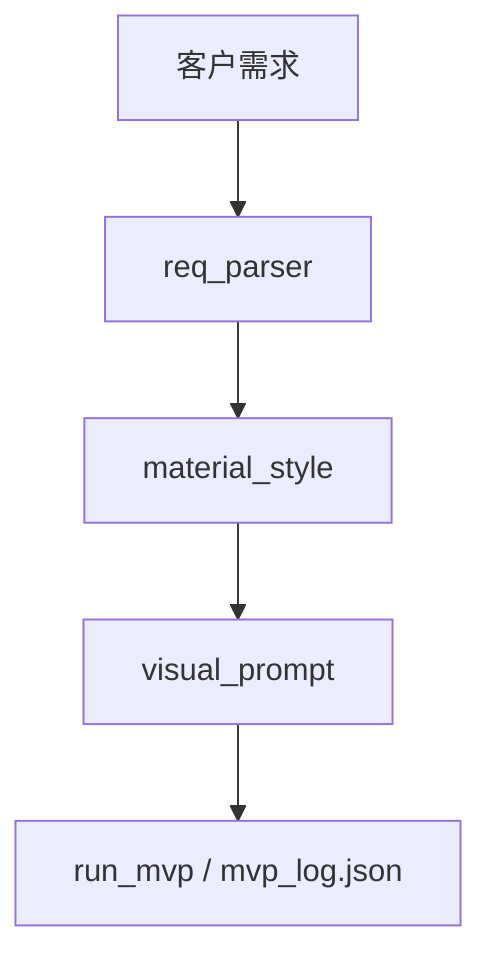
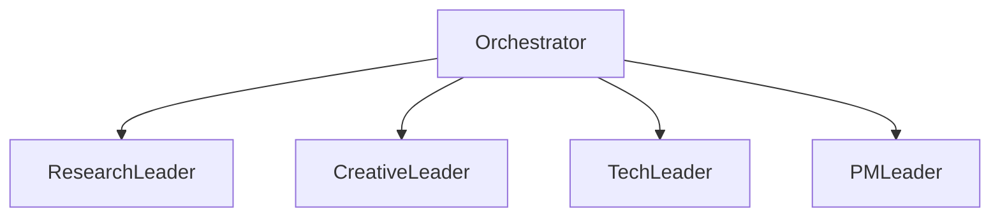

# Workflow Diagram

```mermaid
flowchart TD
    A["客户需求"] --> B["req_parser"]
    B --> C["material_style"]
    C --> D["visual_prompt"]
    D --> E["run_mvp / mvp_log.json"]
```

```mermaid
flowchart TD
    O["Orchestrator"] --> R["ResearchLeader"]
    O --> C["CreativeLeader"]
    O --> T["TechLeader"]
    O --> P["PMLeader"]
```
